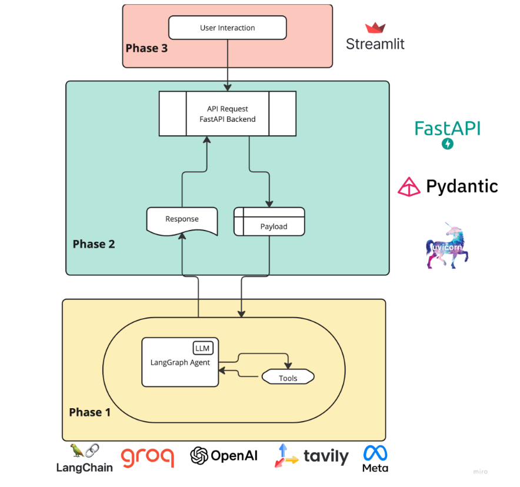
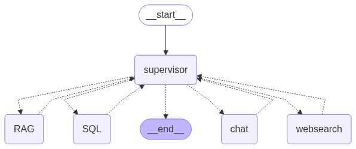

<h1 align="center">👨‍⚕️ Medical AI Agent 🧠</h1>
<p align="center">
  
</p>
<p align="center">
  An intelligent multi-agent medical assistant powered by LangGraph, Streamlit, and modern LLMs.
</p>

---

## 📌 Project Overview

**Medical AI Agent** is a conversational AI assistant designed to help users with healthcare-related queries, database exploration, guideline retrieval, and general medical assistance. Built on **LangGraph**, it dynamically routes user queries to the most relevant expert agent using **structured decision logic** via a Supervisor node.

This system integrates **PDF-based retrieval**, **structured SQL querying**, real-time **web search**, and a casual **chat assistant**—all orchestrated through a powerful **LangGraph state machine**.

### ✨ Key Features:

🧠 Intelligent query routing via a **Supervisor agent** powered by LLM reasoning

📄 **Guideline-based RAG (PDF) agent:** Retrieves medical infection control policies using Pinecone + LLMs

🗄️ **SQL agent:** Answers clinical and epidemiological questions using structured data tables

🌐 **Web search agent:** Handles real-time or out-of-scope queries with Tavily API

💬 **Chat agent:** Responds to casual, personal, or coding/math-related queries

🎤 **Voice input + TTS:** Integrated via Whisper (ASR) and PlayAI (Text-to-Speech)

The **Supervisor agent** ensures that:

- Each query is **handled by the most appropriate agent**

- Redundant agent calls are avoided

- The response is **complete and user-friendly**

---

## 🚀 System Capabilities
✅ **Multi-agent orchestration** using LangGraph’s `StateGraph`

✅ **Supervisor logic with prompt-based JSON routing**

✅ **Tool-aware ReAct agents** for each domain

✅ **Fallback search using Tavily** for unresolved queries

✅ **Real-time response pipeline** (Streamlit frontend → FastAPI backend → LangGraph agents)

## 🧠 System Architecture Overview

The medical AI agent system works in **three main stages**:

 1. **User Interaction (Frontend)**: The user enters a medical query via the Streamlit interface.
 2. **Backend Processing**: The query is sent to a FastAPI server, which routes it to LangGraph agents using tools like RAG, SQL, and Web Search.
 3. **Agent Response**: The response is generated, sent back to the backend, and displayed in the frontend UI.



## 🔄 Agent Graph View

The LangGraph-powered multi-agent system compiles the full graph of interactions, shown below:



---

## ⚙️ Tech Stack

🐍 **Python 3.12**
🔗 **LangGraph / LangChain**
📺 **Streamlit**
🚀 **FastAPI**
🌲 **Pinecone (RAG)**
🛠️ **Whisper ASR** (Groq)
🗣️ **PlayAI TTS**
🤖 **OpenAI / Groq / HuggingFace models**
🌐 **Tavily for Web Search**
📦 **uv as the package manager**

## 🗄️ Dataset and Knowledge Sources

📄 **Medical PDFs**: Infection prevention & control guidelines (indexed in Pinecone)
🛢️ **SQL Tables**:
  - `Stroke prediction dataset`
  - `Water pollution and disease correlations`
  - `Lung cancer survey data`
  - `Breast cancer clinical records`
🌐 **Web Search:** Tavily-powered access to live health, science, weather, news, and more

---

## 💻 Local Usage Instructions

### 1. **Clone the Repository**
```bash
git clone https://github.com/kousik23naskar/Medical_Ai_Agent.git
cd Medical_Ai_Agent
```
### 2. **Set Up Virtual Environment with uv**
```bash
uv venv --python=python3.12
source .venv/bin/activate
```
### 3. **Install Dependencies**
```bash
uv pip install -r requirements.txt
```
### 4. **Set Up Environment Variables**
```bash
OPENAI_API_KEY="your-openai-key"
GROQ_API_KEY="your-groq-key"
TAVILY_API_KEY="your-tavily-key"
PINECONE_API_KEY="your-pinecone-key"
LANGCHAIN_PROJECT="Medical ai agent"
```
### 5. **Run Backend API**
```bash
uvicorn main:app --reload
```
### 6. **Run the Streamlit Frontend**
```bash
streamlit run app.py
```

Now open your browser and go to the URL provided by Streamlit (usually `http://localhost:8501`).

## 🐳 Docker Setup (Optional)

You can run the full backend via Docker as an alternative to local setup.

### 🔧 Build the Docker Image
```bash
docker build -t kousiknaskar/medical-ai-agent-api .
```
### 🚀 **Run the Docker Container**
```bash
docker run --env-file .env -p 8000:8000 kousiknaskar/medical-ai-agent-api
```

## 📊 **Evaluation and Results**
  - **Smart Agent Switching:** Uses context-aware routing for best response selection

  - **Voice & TTS:** Smooth audio input/output integration

  - **Database + RAG synergy:** Rich factual responses based on structured and unstructured data

## ✅ Strengths
  - **Flexible multi-agent architecture**

  - **Voice support** using Whisper + PlayAI

  - **Rich interface** via Streamlit

  - **Local development compatible** (no cloud lock-in)

## 🧪 Limitations
  - Only handles specific medical datasets

  - Requires strong API keys (Groq, Pinecone, OpenAI, etc.)

  - Web search agent depends on Tavily

## 🔧 Future Enhancements
  - Add feedback loop for agent learning

  - Expand dataset coverage (e.g., cancer genomics)

  - Integrate LangGraph visual debugging tools

## 🤝 Contributing
We welcome contributions! Open issues, discuss features, or submit PRs to make the medical assistant smarter and better.

## 📜 License
This project is licensed under the [MIT License](LICENSE).

## 📩 Contact
  - **Email:** kousik23naskar@gmail.com

  - **LinkedIn:** [Kousik Naskar](https://www.linkedin.com/in/dr-kousik-naskar/)

Thanks for exploring our AI-powered medical assistant! 🩺
